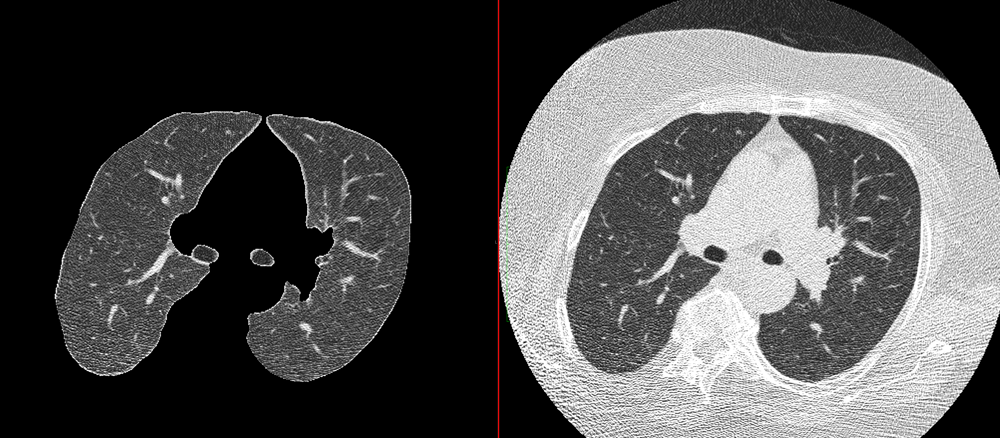
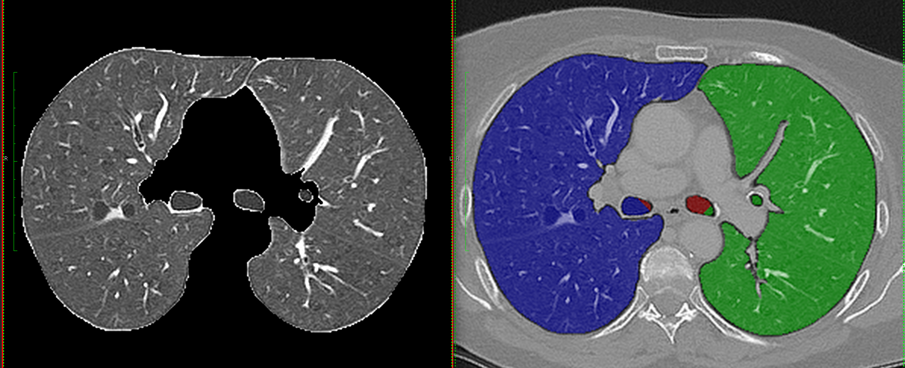

# Basic Lung Segmentation using itk

This program is using a series of labelling and morphological operations to extract the Lung volume intensity image from chest CT scans. It was tested with the data from the LIDC-IDRI (Lung Image Database Consortium) project and depends on ITK/cmake.



After the initial step of extracting the intensities of the lungs and airways the algorithm attempts to separate the two lungs and the airways.



## Build

This tool depends on itk and cmake. As a simple way to document (and build) the project file a Dockerfile is provided. It should be sufficient to build the docker container once

```
docker build -t lungsegmentation -f Dockerfile .
```

and to run it using

```
> docker run --rm -it lungsegmentation
Usage : ./LungSegmentation
 System tags: 
   [ -v ] or [ -h ]
      = List options in short format
   [ -V ] or [ -H ]
      = List options in long format
   [ -vxml ] or [ -hxml ] or [ -exportXML ]
      = List options in xml format for BatchMake
   [ --xml ]
      = List options in xml format for Slicer
   [ -vgad ] or [ -hgad ] or [ -exportGAD ]
      = List options in Grid Application Description format
   [ -version ]
      = return the version number
   [ -date ]
      = return the cvs checkout date
 Command tags: 
   [ -n [ seriesname ] ]
      = Select series by series name (if more than one series is present).
   [ -b < labelfieldfilename > ]
      = Save the label field as a nifty file in the current directory
   [ -u < niftyfilename > ]
      = Save the corrected dataset as a nifty image to the current directory
   [ -V ]
      = Print more verbose output
 Command fields: 
   < indir > 
      = Directory with input DICOM image series.
   < outdir > 
      = Directory for output DICOM image series.
```

In order to provide the data for processing the docker call should also include a '-v' to mount your data directory inside the docker container. Here an example call that assumes you have a 'data/folder_with_dicom' directory in your current directory. The following call will save the output in the same folder.

```bash
docker run --rm -it -v `pwd`/data:/data lungsegmentation /data/folder_with_dicom /data/folder_with_dicom_segmented
```

### Debug build

Adjust the CMakeLists.txt file with the path for your itk version.

```bash
cmake -DCMAKE_BUILD_TYPE=Debug .
make
```

## Generating training data for vessel tracing algorithms

The program FakeLungVolumes generates artificial vessel volumes. As those are generated by a noise smoothing process the data is artificial and only resembles vessels. Generation of such volumes is fast and can be tailored to resemble tissues of a given scale from micro-vascular trees to images resembling larger pulmonary vessel imaged with contrast CT.

The algorithm calculates the discrete intersection of two iso-surfaces from band-pass filtered white noise volumes. Based on the amount of band-pass filtering and the threshold for the iso-surface intersection detection blood-vessel like pattern appear.

To generate a 64 by 64 by 64 volume:

```bash
./FakeLungVolumes /tmp/output.nii 
```

To generate a higher resolution volume

```bash
./FakeLungVolumes -k 7 -t 0.0001 -f 1 -r 128x128x128 /tmp/output.nrrd
```

The generated output is artificially restricted to 12bit simulating common detector resolution. The intensity range is 0 to 4096. This does not correspond to HU but may be sufficient to generate test data for machine learning algorithms. 

To visualize the vessel generation process additionally to the vessels a four-class void space segmentation can be enabled. These void spaces are defined by the sign of the two band-pass filtered white noise volumes. Here an example:

```bash
./FakeLungVolumes -k 7 -t 0.0001 -w 0.0001 -f 1 -r 128x128x128 /tmp/output.nii
```

Here are all the options:

```bash
Option outfile is required but not defined
 Command tags: 
   [ -r [ resolution ] ]
      = Specify the resolution of the volume to be generated (in pixel as in 64x64x64).
   [ -k [ kernelSize ] ]
      = Specify the kernel size for the Gaussian in pixel (7).
   [ -i [ iterations ] ]
      = Specify the number of times the Gaussian kernels are applied (2).
   [ -t [ threshold ] ]
      = Specify the threshold for zero-crossing (0.0001).
   [ -z [ zero ] ]
      = Specify at what value the intersection should be calculated (0).
   [ -f [ finalsmooth ] ]
      = Specify the kernel size of a smoothing with a Gaussian at the end of the process (0).
   [ -n [ additivewhitenoise ] ]
      = Add some noise with "mean variance" (0, 2). Additive white noise is appropriate for simulated CT images.
   [ -w [ voidspaces ] ]
      = Create void spaces with a given distance away from the lines. Default is that this option is not used. 
        In the resulting volume 0 will be the gap space right next to each vessel (label 4095) with 1, 2, 3, 4
        the values of voxel that are in void space.
   [ -l [ addlesion ] ]
      = Specify a lesion of a specific size (5). Requires the option VoidSpaces.
   [ -d [ outputdensities ] ]
      = Specify the output density values used for each segmentation ("0 1 2 3 4 2048 4096"). Requires the option VoidSpaces.
   [ -m [ mask ] ]
      = Specify a mask file (assumption is that the mask fits in resolution with the volume created).
   [ -s [ randomseed ] ]
      = Specify the value used for initialization of the random numbers (time based). The same value should produce the same fields.
   [ -f ]
      = Ignore existing files and force overwrite.
   [ -V ]
      = Print more verbose output
 Command fields: 
   < outfile > 
      = Exported file name.
```

In the above options the size of the vessel structures is defined by the size of the filter kernel (-k 7) and the number of iterations that the filter is applied to the white noise input (-i 2). 


Computation time for the higher resolution volume is about 0.5seconds.

In order to explain the process geometrically the 'explain' sub-directory contains a website that performs this computation in JavaScript. By changing the number of iterations of the smoothing in 1-D, 2-D, and 3-D the different features can be visualized.

There are a number of extensions to this framework. One is that multiple vessel like structures can be generated with guaranteed properties. They will never intersect and keep a given distance from each other. Those hugging lines can be generated using the -z option to specify the crossing in conjunction with the seed option -s to make sure multiple runs of the program generate the same noise pattern. Given the same seed but different crossing levels vessel structures emerge. Here an example of the resulting 3 vessel like structures using Iso-Surface displays. This data was generated using three calls to the program:
```
./FakeLungVolumes -s 42 -z 0 -k 7 -t 0.0001 -f 0.4 -r 192x192x192 /tmp/output.nii
./FakeLungVolumes -s 42 -z 0.002 -k 7 -t 0.0001 -f 0.4 -r 192x192x192 /tmp/output2.nii
./FakeLungVolumes -s 42 -z -0.002 -k 7 -t 0.0001 -f 0.4 -r 192x192x192 /tmp/output3.nii
```


At lower resolution and in 2-D cross-section:


As a final example here a closeup of a de novo in silico complex tissue.


### Generating Lung Tissue with Lesions

In order to generate training data several options have been added. We can create a label volume and a volume with more realistic densities - and noise.

```bash
./FakeLungVolumes -t 0.0001 -w 0.0001 -r 64x64x64 -l 9 -n "0 50" -d "-900 -900 -900 -900 -900 50 50" /output/output.nii
```

In the above example we have an ellipsoid lesion (l) of diameter 9 (pixel) with a random aspect ratio of (0.4..1) where the second and third axis are equal. We are adding noise at the very end with a standard deviation of 0 (and a mean of 0). And we code the different regions using density values such that (-d):

 - Background intensity is set to -900
 - The 4 void spaces are also set to a density of -900
 - The lesion has a density of 50
 - The vessels have a density of 50

Given a specific seed for the random key (-s) we can generate an approximate density and a label volume with:

```bash
./FakeLungVolumes -i 2 -k 5 -s 1 -t 0.0002 -w 0.0001 -r 64x64x64 -l 5 -d "-900 -900 -900 -900 -900 50 50" -n "0 30" -f 0.5 /output/output.nii
./FakeLungVolumes -i 2 -k 5 -s 1 -t 0.0002 -w 0.0001 -r 64x64x64 -l 5 -d "0 0 0 0 0 1 0" /output/label.nii
```

In the above label volume only the lesion (size 5) will have a label value of 1. Generating larger amounts of test data for deep learning can now be created with:

```bash
mkdir output
mkdir label
for i in `seq 1 10`; do 
  case=`printf '%04d' $i`
  ./FakeLungVolumes -i $i -k 5 -s 1 -t 0.0002 -w 0.0001 -r 64x64x64 -l 5 -d "-900 -900 -900 -900 -900 50 50" -n "0 30" -f 0.5 output/${case}.nii
  ./FakeLungVolumes -i $i -k 5 -s 1 -t 0.0002 -w 0.0001 -r 64x64x64 -l 5 -d "0 0 0 0 0 1 0" label/${case}.nii
done
```
